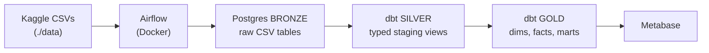

# Olist E-commerce ELT (Postgres + dbt)

Local-only ELT pipeline on the Olist Brazilian E-commerce dataset (Kaggle).
Airflow loads 8 CSVs into a Postgres `bronze` schema, then dbt builds
typed staging models and a dimensional warehouse with RFM customer
segmentation and seller / category / state performance marts.

Originally this repo was a fork of a generic AWS Redshift template with
no actual project content. Rebuilt as a real, runnable, zero-cost
project on Postgres + dbt.

## Stack

- Python 3.11
- Apache Airflow 2.9 — Docker, LocalExecutor on Postgres metadata
- Postgres 15 — analytical warehouse (separate from the Airflow metadata DB)
- dbt-postgres 1.7 — bronze → silver → gold modeling
- Metabase — optional BI on `localhost:3000`

Everything runs on the laptop. No cloud, no bill.

## Architecture



## Warehouse layers

- **`bronze`** — raw CSVs loaded as-is by the Airflow DAG (8 tables, all `text` columns).
- **`silver`** — dbt staging models (views): `stg_customers`, `stg_orders`, `stg_order_items`, `stg_order_payments`, `stg_order_reviews`, `stg_products`, `stg_sellers`. Typed, deduped, NULL-cleaned.
- **`gold`** — dbt marts (tables):
  - Dims: `dim_customer`, `dim_product`, `dim_seller`
  - Facts: `fct_orders` (order grain w/ payment + review rollups + delivery KPIs), `fct_order_items` (line grain)
  - Marts: `mart_customer_rfm`, `mart_category_performance`, `mart_seller_performance`, `mart_state_performance`

dbt tests are wired up in `_schema.yml` (uniqueness, not-null, FK relationships, accepted values).

## Setup

1. **Kaggle CSVs** — get them locally one way or the other:

   **Option A (Kaggle CLI):**
   ```bash
   pip install kaggle
   export KAGGLE_USERNAME=your_kaggle_user
   export KAGGLE_KEY=your_kaggle_key   # from https://www.kaggle.com/settings → API
   make seed
   ```

   **Option B (manual):** download
   <https://www.kaggle.com/datasets/olistbr/brazilian-ecommerce>, unzip
   the 8 CSVs into `./data/`.

2. **Env file:**
   ```bash
   cp .env.example .env
   ```
   Defaults work for local; tweak `WAREHOUSE_PASSWORD` if you want.

3. **Bring up the stack:**
   ```bash
   make up
   ```

   First boot builds the custom Airflow image (Airflow + dbt-postgres) —
   a few minutes the first time.

4. Open <http://localhost:8080> (admin / admin), enable `olist_pipeline`,
   trigger it.

## DAG

```
load_bronze_customers ─┐
load_bronze_orders ────┤
load_bronze_order_items ─┤
load_bronze_order_payments ─┤
load_bronze_order_reviews ──┤──► dbt_build  (dbt run + dbt test)
load_bronze_products ─────┤
load_bronze_sellers ──────┤
load_bronze_product_category_translation ─┘
```

`dbt_build` runs `dbt build`, which is `dbt run` + `dbt test` in dep
order — so a single task gives you both the models and the data quality
checks.

## Sample queries

Top 10 customer segments by lifetime value:

```sql
SELECT segment, COUNT(*) AS customers,
       ROUND(AVG(lifetime_value), 2) AS avg_ltv,
       ROUND(SUM(lifetime_value), 2) AS total_ltv
FROM gold.mart_customer_rfm
GROUP BY segment
ORDER BY total_ltv DESC;
```

Best- and worst-delivering Brazilian states:

```sql
SELECT customer_state, order_count,
       ROUND(total_revenue, 0) AS revenue_brl,
       avg_delivery_days, avg_review_score
FROM gold.mart_state_performance
ORDER BY avg_review_score DESC;
```

Top 15 product categories by gross revenue:

```sql
SELECT product_category, order_count,
       ROUND(gross_revenue, 0) AS revenue_brl,
       avg_delivery_days
FROM gold.mart_category_performance
ORDER BY gross_revenue DESC NULLS LAST
LIMIT 15;
```

## Local dbt (without the Airflow DAG)

Useful when iterating on models — much faster than re-triggering the DAG:

```bash
python3 -m venv .venv && source .venv/bin/activate
pip install dbt-postgres
export WAREHOUSE_HOST=localhost WAREHOUSE_PORT=5433 \
       WAREHOUSE_USER=olist WAREHOUSE_PASSWORD=olist_local_dev WAREHOUSE_DB=olist
make dbt-run
make dbt-test
```

Warehouse is exposed on `localhost:5433` so you can connect from your
laptop with `psql`, dbt, or any BI client.

## Notes / gotchas

- **Bronze schema is all `text`.** Type casts happen in staging. This
  matches what most real ELTs do — landing zone is permissive, casting
  is explicit and reviewable in SQL.
- **Geolocation table** isn't loaded. It has ~1M rows of zip-code lat/lng
  and isn't needed for the marts here. Adding it later is a 10-line
  change in the DAG + a `stg_geolocation` model.
- **Airflow 2.9 needs SQLAlchemy <2.0**, but that conflict only bites
  the Airflow container. The dbt project is independent.
- **`dbt build` is one task on purpose.** Splitting it per-model in
  Airflow is possible (`cosmos`, hand-rolled), but for a project this
  size it's needless complexity. dbt's DAG already understands the deps.

## Roadmap

- [ ] Add `stg_geolocation` + a customer-to-seller distance metric
- [ ] dbt snapshots on `dim_seller` (SCD2) to track relocations
- [ ] Cosmos-style task-per-model breakdown so the Airflow graph mirrors
      the dbt graph
- [ ] Looker / Metabase dashboard committed under `docs/`
- [ ] Switch from CSV-COPY load to incremental ingestion driven by
      `order_purchase_timestamp` watermarks
